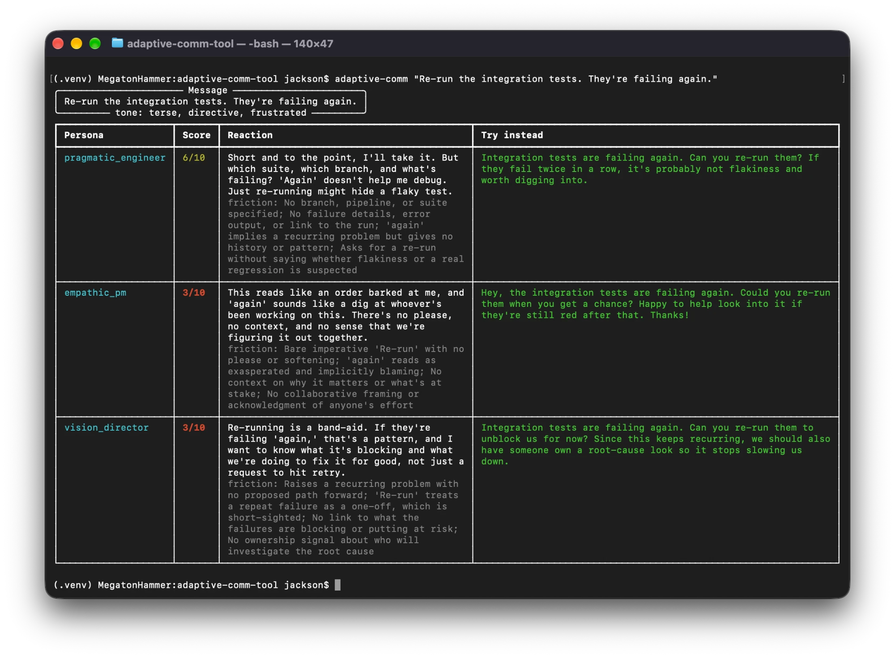

# adaptive-comm-tool

[](https://github.com/jackson-asmith/adaptive-comm-tool/actions/workflows/ci.yml)

**See how your message lands with different people before you hit send.**

The same Slack message can read as efficient to one teammate and dismissive to another. `adaptive-comm` takes a message and a set of personas (the people who will read it), then uses Claude to:

- score how well the message lands with each persona (0–10)
- explain their likely reaction, in their own voice
- point out the exact words or omissions that cause friction
- **rewrite the message for each persona** while keeping your intent and your ask

## Example

```bash
adaptive-comm "Re-run the integration tests. They're failing again."
```



<details>
<summary>Same run as text</summary>

**Tone:** terse, directive, frustrated

| Persona | Score | Try instead |
|---|---|---|
| pragmatic_engineer | 6/10 | Integration tests are failing again. Can you re-run them? If they fail twice in a row, it's probably not flakiness and worth digging into. |
| empathic_pm | 3/10 | Hey, the integration tests are failing again. Could you re-run them when you get a chance? Happy to help look into it if they're still red after that. Thanks! |
| vision_director | 3/10 | Integration tests are failing again. Can you re-run them to unblock us for now? Since this keeps recurring, we should also have someone own a root-cause look so it stops slowing us down. |

Each persona also gets a reaction in their own voice and a list of friction points. For example, the PM's reaction: *"This reads like an order barked at me, and 'again' sounds like a dig at whoever's been working on this."*

</details>

Wording varies from run to run.

## Install

Requires Python 3.10+ and an [Anthropic API key](https://console.anthropic.com/).

> **Privacy:** messages you analyze are sent through Anthropic's API, along with your persona definitions. Don't paste anything you wouldn't share with a third-party service. See [Anthropic's privacy policy](https://www.anthropic.com/legal/privacy) for how API data is handled.

```bash
git clone https://github.com/jackson-asmith/adaptive-comm-tool.git
cd adaptive-comm-tool
pip install -e .
export ANTHROPIC_API_KEY=sk-ant-...
```

## Usage

```bash
# Short messages as arguments (each argument is one message)
adaptive-comm "Can we push the deadline to Friday?" "LGTM 👍"

# Longer text: copy it, then open it from the clipboard in an editor in
# your terminal. Review or change it, then press Ctrl-S to send (Ctrl-C cancels).
# No shell quoting, so !, apostrophes, and parentheses are all fine.
adaptive-comm -c
adaptive-comm -c -y    # send the clipboard as-is, without the editor

# Or run with no arguments to open the editor empty, then paste or type
adaptive-comm

# After the results, type a persona's number to copy their rewrite
# to the clipboard as clean text (Enter to finish).

# Or pipe it in, or read it from a file (the whole input is one message)
pbpaste | adaptive-comm
adaptive-comm --file draft.txt

# Batch mode: one message per line
adaptive-comm --each-line --file drafts.txt

# Only check against specific personas
adaptive-comm --only empathic_pm --only vision_director "Let's revert this."

# JSON output, for scripting or saving a report
adaptive-comm --json "Ship it." > report.json
adaptive-comm -o report.json "Ship it."     # tables on screen, JSON to file

# See which personas are loaded
adaptive-comm --list-personas
```

| Option | Description |
|---|---|
| `-c, --clipboard` | Open the clipboard text in the editor (macOS, Linux with wl-clipboard or xclip, Windows/WSL) |
| `-y, --yes` | With `-c`, send the clipboard text as-is instead of opening the editor |
| `-f, --file PATH` | Read one message from a file (`-` for stdin) |
| `--each-line` | Treat each non-empty line of the file or stdin as its own message |
| `-p, --personas PATH` | Use your own personas YAML file |
| `--only NAME` | Only use this persona (repeatable) |
| `--json` | Print JSON instead of tables |
| `-o, --output PATH` | Also write the JSON report to a file |
| `--model` | Claude model (default `claude-opus-5-5`) |
| `--effort` | Reasoning effort: `low`, `medium` (default), `high`, `xhigh`, `max` |
| `--version` | Print the version and exit |

`-y` only works together with `-c`, and `--each-line` only applies to `--file`, `-c`, or piped input. Anything else is rejected rather than silently ignored.

Before sending anything, the tool checks that it has credentials and that the `-o` path is writable, so a typo can't waste a paid call. If a run over several messages is stopped partway (an API error, or Ctrl-C), the results that already finished are still shown and saved.

**Exit codes:** `0` if every message was analyzed, `1` if any failed or the run was stopped or cancelled, `2` for usage errors (bad flags, missing file, no credentials).

## Define your own personas

The built-in personas are a pragmatic engineer, an empathic PM, and a vision-focused director (see [`personas.yaml`](src/adaptive_comm/personas.yaml)). To model your own team, write a YAML file:

```yaml
priya:
  role: Staff engineer, owns the payments service
  description: Protective of on-call load and allergic to surprise changes.
  values: [advance notice, data over opinions, respecting ownership]
  dislikes: [drive-by requests, "quick" asks that aren't quick]

sam:
  role: New grad on the team
  description: Eager, but can read a terse message as disapproval.
  values: [encouragement, explicit next steps]
  dislikes: [sarcasm, unexplained jargon]
```

```bash
adaptive-comm --personas my_team.yaml "Why was this merged without review?"
```

Each persona needs `role`, `values`, and `dislikes`. `description` is optional.

## How it works

For each message, the tool makes one request to the Claude API that includes all the personas. It uses [structured outputs](https://docs.claude.com/en/docs/build-with-claude/structured-outputs), so the response always matches a JSON schema, and persona names are pinned to an enum so Claude can't invent or drop one. The response is validated with Pydantic and rendered with [Rich](https://github.com/Textualize/rich).

```
src/adaptive_comm/
├── personas.py     # load and validate persona YAML
├── personas.yaml   # built-in personas
├── analyzer.py     # prompt, JSON schema, API call, response validation
├── editor.py       # in-terminal editor for reviewing a message before sending
├── clipboard.py    # read and write the clipboard with the platform's tool
└── cli.py          # argument parsing, input, and table/JSON output
```

If a safety classifier declines a request, the API retries it on a fallback model instead of failing the whole run (server-side fallbacks).

## Development

```bash
pip install -e '.[dev]'
pytest                                   # run the tests
coverage run -m pytest && coverage report  # with coverage
ruff check src tests && ruff format --check src tests  # lint and format
mypy                                     # type check (strict)
```

The tests use a fake client, so they need no API key and make no network calls. One test round-trips non-ASCII text through your real clipboard; it's skipped unless you set `ADAPTIVE_COMM_CLIPBOARD_TESTS=1`, because it overwrites what you've copied. CI runs it on Windows and macOS.

## History

This started as a small rule-based script that matched keywords like "blunt" and "emoji" against fixed persona traits. The first commit in this repo keeps that version for comparison.

## License

MIT
